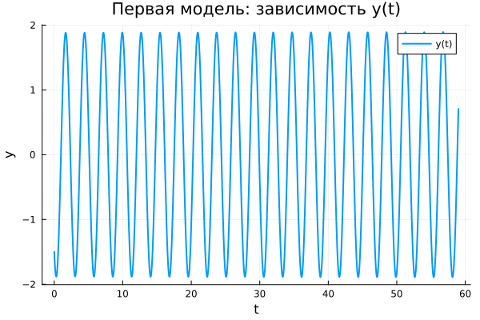

---
## Author
author:
  name: Сергей Павленко
  email: 1032235465@rudn.ru
  affiliation:
    - name: Российский университет дружбы народов
      country: Российская Федерация
      postal-code: 117198
      city: Москва
      address: ул. Миклухо-Маклая, д. 6

## Title
title: "Математическое моделирование"
subtitle: "Лабораторная работа № 4"
license: "CC BY"
---

# Цель работы

Исследовать свойства и поведение решений уравнения гармонического осциллятора при различных условиях.

# Задание

1. Получить и проанализировать решение уравнения гармонического осциллятора без учета затухания  
2. Сформулировать уравнение свободных затухающих колебаний, исследовать его решение и построить фазовый портрет  
3. Рассмотреть случай наличия внешнего воздействия, найти решение и проанализировать фазовую динамику  

# Выполнение лабораторной работы

## Теоретические сведения

Множество физических процессов — от механических колебаний до электрических цепей — можно описать с помощью единой математической модели. Такой универсальной моделью является линейный гармонический осциллятор.

Общее уравнение движения имеет вид:
$$
\ddot{x} + 2\gamma \dot{x} + \omega_0^2 x = 0
$$

Здесь $x$ характеризует состояние системы, $\gamma$ определяет интенсивность потерь энергии, а $\omega_0$ задаёт собственную частоту.

При отсутствии диссипации ($\gamma = 0$) система становится консервативной:
$$
\ddot{x} + \omega_0^2 x = 0
$$

Для корректного решения требуется задать начальные условия:
$$
\begin{cases}
x(t_0) = x_0 \\
\dot{x}(t_0) = y_0
\end{cases}
$$

Переход к системе первого порядка:
$$
\begin{cases}
\dot{x} = y \\
\dot{y} = -\omega_0^2 x
\end{cases}
$$

Соответствующие начальные условия:
$$
\begin{cases}
x(t_0) = x_0 \\
y(t_0) = y_0
\end{cases}
$$

Пара $(x, y)$ задаёт точку в фазовом пространстве. Эволюция системы во времени формирует фазовую траекторию. Совокупность таких траекторий образует фазовый портрет, отражающий динамику системы при различных начальных состояниях.

## Задача

Требуется исследовать следующие модели:

1. Без затухания:
$$
\ddot{x} + 5.2x = 0
$$

2. С затуханием:
$$
\ddot{x} + 14\dot{x} + 0.5x = 0
$$

3. С затуханием и внешним воздействием:
$$
\ddot{x} + 13\dot{x} + 0.3x = 0.8\sin(9t)
$$

Параметры моделирования:
$$
t \in [0;59], \quad h = 0.05, \quad x_0 = 0.5, \quad y_0 = -1.5
$$

### Преобразование моделей

1. Без затухания:
$$
\begin{cases}
\dot{x} = y \\
\dot{y} = -\omega_0^2 x
\end{cases}
$$

2. С затуханием:
$$
\begin{cases}
\dot{x} = y \\
\dot{y} = -2\gamma y - \omega_0^2 x
\end{cases}
$$

3. С внешней силой:
$$
\begin{cases}
\dot{x} = y \\
\dot{y} = F(t) - 2\gamma y - \omega_0^2 x
\end{cases}
$$

Для численного решения использовались внешние программные модули:





## Базовые эксперименты

### Первая модель (model_type = model1)

Поведение системы демонстрирует устойчивые периодические колебания. Амплитуда остаётся неизменной на всём промежутке времени, что указывает на отсутствие потерь энергии.

Фазовая траектория представляет собой замкнутую кривую, что свидетельствует о повторяемости движения и устойчивости динамики.

Таким образом, система реализует классические незатухающие колебания.

### Вторая модель (model_type = model2)

Здесь наблюдается быстрое снижение амплитуды. Переменная $y(t)$ стремится к нулю уже на начальном этапе.

Наличие демпфирования приводит к рассеянию энергии, вследствие чего система стабилизируется в состоянии равновесия.

Фазовый портрет показывает сходимость траекторий к фиксированной точке.

Следовательно, реализуется режим апериодического затухания.

### Третья модель (model_type = model3)

Система сочетает затухание и внешнее воздействие. После переходного процесса формируются устойчивые вынужденные колебания.

Амплитуда меньше, чем в первой модели, но не исчезает из-за постоянного внешнего возбуждения.

Фазовый портрет ограничен компактной областью, что указывает на установившийся режим.

## Параметрическое сканирование

### Траектории $x(t)$

Анализ показал:

- изменение параметра в первой модели влияет на частоту  
- во второй модели регулируется скорость затухания  
- в третьей модели меняется характер вынужденных колебаний  

### Траектории $y(t)$

Результаты подтверждают:

- устойчивые колебания в первой модели  
- быстрое затухание во второй  
- устойчивые малые колебания в третьей  

## Время вычислений

Сравнение показало:

- наименьшие затраты у первой модели  
- умеренные — у второй  
- максимальные — у третьей  

Несмотря на различия, вычисления выполняются быстро.

## Анализ метрики norm_final

Рассматривалась величина:
$$
\text{norm\_final} = \sqrt{x(t_{final})^2 + y(t_{final})^2}
$$

Полученные результаты:

- в первой модели значение остаётся значительным  
- во второй стремится к нулю  
- в третьей стабилизируется на малом уровне  

# Выводы

1. Незатухающая модель демонстрирует устойчивую периодическую динамику  
2. Наличие демпфирования приводит к затуханию колебаний  
3. Внешняя сила формирует режим вынужденных колебаний  
4. Параметры существенно влияют на характеристики движения  
5. Численные методы обеспечивают эффективное моделирование  
6. Метрика $\text{norm\_final}$ отражает различия в поведении систем  

# Список литературы {.unnumbered}

1. [Гармонический осциллятор](https://ru.wikipedia.org/wiki/Гармонический_осциллятор)
2. [Модели колебательных систем](https://www.numamo.org/HTML/Articles/Oscillator.html)
