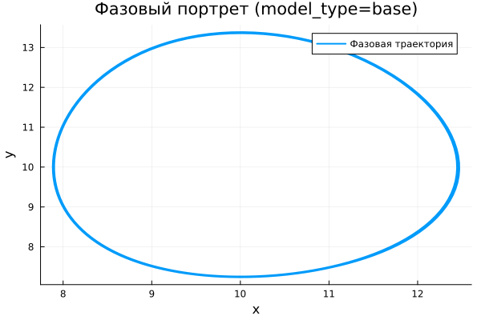
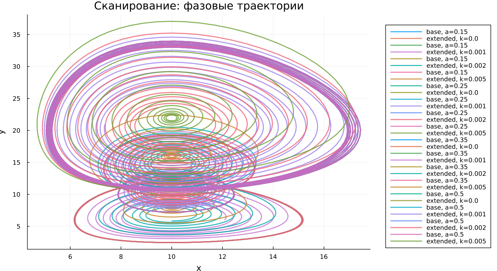

---
## Author
author:
  name: Сергей Павленко
  email: 1032235465@rudn.ru
  affiliation:
    - name: Российский университет дружбы народов
      country: Российская Федерация
      postal-code: 117198
      city: Москва
      address: ул. Миклухо-Маклая, д. 6

## Title
title: "Математическое моделирование"
subtitle: "Лабораторная работа № 5"
license: "CC BY"
---

# Цель работы

Освоить и проанализировать математическую модель взаимодействия популяций типа «хищник–жертва».

# Задание

1. Построить фазовую зависимость $x(y)$, а также временные зависимости $x(t)$ и $y(t)$  
2. Определить стационарные состояния системы  

# Выполнение лабораторной работы

## Теоретические сведения

В работе исследуется классическая модель взаимодействия двух популяций — хищников и жертв.

Обозначим численности популяций как $X$ (хищники) и $Y$ (жертвы). Предполагается, что система удовлетворяет следующим условиям (модель Лотки–Вольтерры):

1. Численности зависят только от времени, без учёта пространственного распределения  
2. При отсутствии взаимодействия динамика описывается моделью Мальтуса: жертвы растут, хищники вымирают  
3. Естественная смертность жертв и естественное размножение хищников не учитываются  
4. Ограничение роста популяций отсутствует  
5. Взаимодействие приводит к уменьшению численности жертв пропорционально числу хищников  

Математическая запись модели:

$$
\begin{cases}
\frac{dx}{dt} = -ax(t) + b x(t)y(t) \\
\frac{dy}{dt} = cy(t) - d x(t)y(t)
\end{cases}
$$

где:
- $a$ — коэффициент убывания хищников  
- $b$ — коэффициент увеличения хищников  
- $c$ — коэффициент роста жертв  
- $d$ — коэффициент гибели жертв  

Система может находиться в равновесии, если отсутствуют изменения во времени:

$$
\frac{dx}{dt} = 0, \quad \frac{dy}{dt} = 0
$$

При условии $x>0$, $y>0$ стационарная точка определяется как:

$$
x_0 = \frac{a}{b}, \quad y_0 = \frac{c}{d}
$$

## Задача

Рассматривается система:

$$
\begin{cases}
\frac{dx}{dt} = -0.25x(t) + 0.025x(t)y(t) \\
\frac{dy}{dt} = 0.45y(t) - 0.045x(t)y(t)
\end{cases}
$$

Требуется:
- построить графики $x(t)$ и $y(t)$  
- построить фазовую траекторию  
- определить равновесное состояние  

Начальные условия: $x_0 = 8$, $y_0 = 11$

Стационарная точка:

$$
x_0 = \frac{a}{b} = 10, \quad y_0 = \frac{c}{d} = 10
$$

Для численного решения применялись внешние программные модули:





## Базовые эксперименты

### Базовая модель (model_type = base)

В базовой постановке система демонстрирует устойчивые колебания без изменения амплитуды. Значения $x(t)$ и $y(t)$ изменяются циклически и повторяют поведение на протяжении всего временного интервала.

Такой режим соответствует идеализированной динамике без диссипации: энергия системы сохраняется, и переход к равновесию не происходит.

Фазовый портрет представляет собой замкнутую траекторию, что подтверждает периодичность процесса и отсутствие затухания.

### Расширенная модель (model_type = extended)

В расширенной модели динамика существенно меняется. На начальном этапе наблюдаются значительные колебания, однако со временем их амплитуда уменьшается.

Причиной является дополнительный член $-k x^2$, ограничивающий рост популяции жертв. В результате система утрачивает консервативные свойства и переходит к затухающим колебаниям.

Фазовая траектория принимает форму спирали, сходящейся к устойчивой точке. Это свидетельствует о наличии устойчивого равновесия.

Таким образом, расширенная модель приводит к стабилизации системы.

## Параметрическое сканирование

### Траектории $x(t)$ для различных параметров

Проведено исследование влияния параметров на поведение системы.

В базовой модели варьирование параметра $a$ изменяет характеристики колебаний (амплитуду и период), однако режим остаётся периодическим.

В расширенной модели изменение параметра $k$ влияет на скорость затухания: при увеличении $k$ система быстрее достигает равновесия.

Основные выводы:
- базовая модель сохраняет колебательный режим  
- расширенная модель приводит к затуханию  
- параметры регулируют динамические характеристики  

### Траектории $y(t)$ для различных параметров

Анализ поведения $y(t)$ показывает аналогичную картину. В базовой модели сохраняются устойчивые колебания.

В расширенной модели наблюдается уменьшение амплитуды и выход на стационарное значение. Увеличение нелинейного параметра ускоряет этот процесс.

### Фазовые траектории для различных параметров

Фазовые диаграммы наглядно демонстрируют различия моделей.

Для базовой модели характерны замкнутые траектории, соответствующие устойчивым циклам.

Для расширенной модели траектории закручиваются к точке равновесия, что указывает на наличие устойчивого аттрактора.

Таким образом, изменение параметров не меняет природу моделей, а лишь влияет на количественные характеристики.

## Анализ метрики norm_final

Рассматривалась величина:

$$
\text{norm\_final} = \sqrt{x(t_{final})^2 + y(t_{final})^2}
$$

Для базовой модели значение метрики остаётся значительным, так как система продолжает колебаться и не достигает равновесия.

В расширенной модели метрика отражает положение стационарного состояния, поскольку колебания затухают.

## Время вычислений

Анализ времени вычислений показывает, что численное решение выполняется быстро для обеих моделей.

Изменение параметров $a$ и $k$ практически не влияет на вычислительную сложность.

Добавление нелинейного члена не приводит к заметному увеличению затрат, что говорит о хорошей эффективности метода.

## Выводы

1. Базовая модель описывает устойчивые периодические колебания без затухания  
2. Расширенная модель приводит к установлению равновесия  
3. Фазовые портреты подтверждают различие динамических режимов  
4. Параметры $a$ и $k$ регулируют форму и скорость динамики  
5. Метрика $\text{norm\_final}$ позволяет различить режимы поведения  
6. Численные методы показывают высокую эффективность для обеих моделей  

# Список литературы {.unnumbered}

1. [Модель Лотки-Вольтерры](https://math-it.petrsu.ru/users/semenova/MathECO/Lections/Lotka_Volterra.pdf)  
2. [Lotka-Volterra System](https://www.sciencedirect.com/topics/mathematics/lotka-volterra-system)
