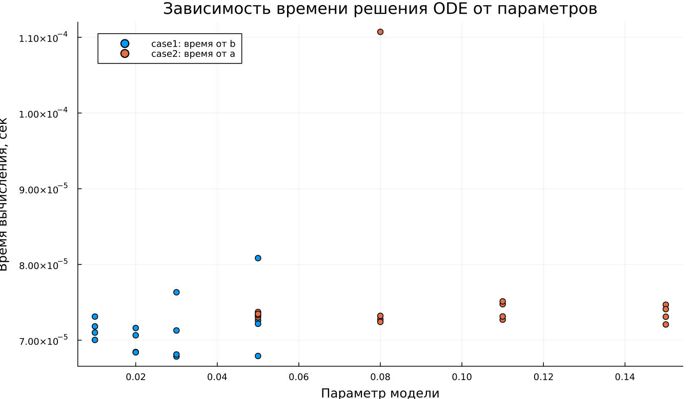

---
author:
  name: Сергей Павленко
  email: 1032235465@rudn.ru
  affiliation:
    - name: Российский университет дружбы народов
      country: Российская Федерация
      city: Москва
title: "Математическое моделирование"
subtitle: "Лабораторная работа № 6"
license: "CC BY"
date: today
date-format: "YYYY-MM-DD"
---

# Вводная часть

## Цель работы

Изучить эпидемиологическую модель $SIR$ и проанализировать изменение численности групп населения в процессе распространения заболевания.

## Задание

1. Рассмотреть модель эпидемии.
2. Построить графики для функций $S(t)$, $I(t)$ и $R(t)$.
3. Исследовать два режима:
   - $I(0) \leq I^*$;
   - $I(0) > I^*$.
4. Провести параметрическое исследование.
5. Сравнить полученные модели по графикам и численным характеристикам.

# Теоретические сведения

## Модель $SIR$

В модели $SIR$ всё население делится на три группы:

- $S(t)$ — восприимчивые к заболеванию;
- $I(t)$ — инфицированные и распространяющие инфекцию;
- $R(t)$ — выздоровевшие или выбывшие из процесса распространения болезни.

Общая численность популяции задаётся формулой:

$$
N = S(t) + I(t) + R(t).
$$

## Логика переходов

Модель описывает последовательный переход особей между группами:

$$
S \rightarrow I \rightarrow R.
$$

Сначала восприимчивые особи заражаются и переходят в группу $I$, затем инфицированные со временем выздоравливают и переходят в группу $R$.

## Критический уровень инфицированных

Пока число заболевших не превышает критическое значение $I^*$, предполагается, что инфицированные изолированы и не заражают остальных.

Если выполняется условие

$$
I(t) \leq I^*,
$$

то новых заражений не происходит.

Если же

$$
I(t) > I^*,
$$

то инфицированные начинают передавать заболевание восприимчивым особям.

## Уравнение для $S(t)$

Изменение числа восприимчивых описывается выражением:

$$
\frac{dS}{dt} =
\begin{cases}
-\alpha S, & I(t) > I^*, \\
0, & I(t) \leq I^*.
\end{cases}
$$

## Уравнение для $I(t)$

Динамика числа инфицированных задаётся системой:

$$
\frac{dI}{dt} =
\begin{cases}
\alpha S - \beta I, & I(t) > I^*, \\
-\beta I, & I(t) \leq I^*.
\end{cases}
$$

## Уравнение для $R(t)$

Число выздоровевших изменяется по закону:

$$
\frac{dR}{dt} = \beta I.
$$

Параметры модели имеют следующий смысл:

- $\alpha$ — коэффициент заражения;
- $\beta$ — коэффициент выздоровления.

# Постановка задачи

## Исходные данные

Рассматривается эпидемия, возникшая на острове.

Дано:

$$
N = 11400,
$$

$$
I(0) = 250,
$$

$$
R(0) = 47.
$$

## Начальное значение $S(0)$

Количество восприимчивых особей в начальный момент определяется как:

$$
S(0) = N - I(0) - R(0).
$$

После подстановки исходных данных получаем:

$$
S(0) = 11400 - 250 - 47 = 11103.
$$

## Исследуемые режимы

В работе рассматриваются два варианта развития эпидемии:

1. $I(0) \leq I^*$ — начальное число инфицированных не превышает критический порог.
2. $I(0) > I^*$ — начальное число инфицированных больше критического значения.

# Базовые эксперименты

## Первая модель: временные зависимости

## Первая модель: фазовый портрет

## Анализ первой модели

В первой модели наблюдается поведение, которое нельзя считать типичным для классической $SIR$-системы:

- значение $S(t)$ не меняется во времени;
- число инфицированных $I(t)$ растёт экспоненциально;
- величина $R(t)$ уменьшается и может принимать отрицательные значения;
- в системе отсутствует механизм, ограничивающий рост заражённых.

## Вывод по первой модели

Первая модель нарушает физический смысл эпидемиологического процесса.

Основная причина состоит в том, что

$$
S(t) = const.
$$

Из-за этого количество восприимчивых не уменьшается, а число инфицированных продолжает расти без естественного ограничения.

# Вторая модель

## Вторая модель: временные зависимости

## Вторая модель: фазовый портрет

## Анализ второй модели

Во второй модели динамика соответствует ожидаемому поведению $SIR$-системы:

- $S(t)$ постепенно уменьшается;
- $I(t)$ сначала увеличивается;
- затем $I(t)$ достигает максимума;
- после пика число инфицированных снижается;
- $R(t)$ монотонно возрастает.

## Интерпретация второй модели

На начальном этапе эпидемия распространяется достаточно быстро, так как число восприимчивых велико.

Затем запас восприимчивых уменьшается, заражение замедляется, и эпидемический процесс постепенно прекращается:

$$
I(t) \rightarrow 0.
$$

# Сравнение базовых моделей

## Качественное различие

| Характеристика | Первая модель | Вторая модель |
|---|---|---|
| $S(t)$ | не изменяется | монотонно убывает |
| $I(t)$ | растёт без ограничения | имеет конечный максимум |
| $R(t)$ | может стать отрицательным | монотонно возрастает |
| Фазовый портрет | почти вертикальная линия | незамкнутая фазовая кривая |
| Физический смысл | нарушается | сохраняется |

# Параметрическое исследование

## Сканирование траекторий $S(t)$

## Анализ траекторий $S(t)$

Для первой модели:

- $S(t)$ остаётся постоянной величиной;
- изменение параметров почти не отражается на числе восприимчивых.

Для второй модели:

- $S(t)$ уменьшается с течением времени;
- при увеличении параметра $a$ спад происходит быстрее.

## Сканирование траекторий $I(t)$

## Анализ траекторий $I(t)$

Первая модель:

- показывает экспоненциальный рост $I(t)$;
- при увеличении параметра $b$ рост становится более резким.

Вторая модель:

- описывает эпидемическую волну;
- $I(t)$ возрастает до максимума;
- после достижения пика число инфицированных уменьшается.

## Сканирование траекторий $R(t)$

## Анализ траекторий $R(t)$

Первая модель:

- приводит к некорректному поведению $R(t)$;
- значения могут уходить в отрицательную область.

Вторая модель:

- отражает накопление выздоровевших;
- $R(t)$ стремится к конечному значению.

## Фазовые траектории

## Анализ фазовых траекторий

Фазовые портреты подтверждают различие между двумя моделями:

- в первой модели траектории имеют вырожденный вид;
- изменение происходит почти только по оси $I$;
- во второй модели траектории соответствуют типичной форме $SIR$-процесса;
- сначала $I$ растёт при уменьшении $S$;
- затем $I$ снижается, а система приближается к конечному состоянию.

# Анализ итоговых метрик

## Метрика $\text{norm\_final}$

Для оценки состояния системы в конце моделирования использовалась метрика:

$$
\text{norm\_final} =
\sqrt{
S(t_{final})^2 +
I(t_{final})^2 +
R(t_{final})^2
}.
$$

Она позволяет сравнить итоговое положение траектории для разных параметров.

## Зависимость $\text{norm\_final}$ от параметра

## Интерпретация $\text{norm\_final}$

Для первой модели:

- значение метрики быстро увеличивается;
- основной причиной является экспоненциальный рост $I(t)$;
- дополнительный вклад вносит некорректное поведение $R(t)$.

Для второй модели:

- значения метрики значительно меньше;
- изменение происходит более плавно;
- система стремится к устойчивому конечному состоянию.

# Максимум инфицированных

## Зависимость $I_{max}$ от параметра

## Анализ $I_{max}$

Первая модель:

- даёт очень большие значения $I_{max}$;
- рост инфицированных не ограничивается;
- увеличение параметра $b$ усиливает этот эффект.

Вторая модель:

- имеет конечный максимум числа инфицированных;
- величина пика зависит от параметра $a$;
- при большем $a$ максимум достигается раньше.

# Анализ вычислений

## Время вычислений

## Интерпретация времени вычислений

Результаты бенчмаркинга показывают:

- обе модели численно решаются быстро;
- время вычисления имеет порядок $10^{-4}$ секунды;
- изменение параметров почти не влияет на вычислительную сложность;
- используемый численный метод работает устойчиво и эффективно.

# Итоги

## Основные результаты

1. Первая модель демонстрирует нефизичную динамику.
2. В ней число инфицированных увеличивается без ограничения.
3. Вторая модель воспроизводит реалистичную эпидемическую волну.
4. Во второй модели после достижения пика эпидемия затухает.
5. При длительном моделировании выполняется условие $I(t) \to 0$.
6. Фазовые портреты наглядно показывают качественное отличие моделей.

## Выводы

1. Модель `case1` не подходит для адекватного описания эпидемического процесса, так как нарушает физический смысл переменных.
2. Модель `case2` согласуется с классической логикой $SIR$-модели и корректно описывает распространение заболевания.
3. Параметры $a$ и $b$ влияют на скорость изменения групп населения и на интенсивность эпидемической волны.
4. Метрики $\text{norm\_final}$ и $I_{max}$ позволяют количественно сравнить поведение моделей.
5. Численное решение обеих моделей выполняется эффективно, а изменение параметров не приводит к существенному росту времени вычислений.

# Список литературы {.unnumbered}

1. [Конструирование эпидемиологических моделей](https://habr.com/ru/post/551682/)
2. [Зараза, гостья наша](https://nplus1.ru/material/2019/12/26/epidemic-math)
