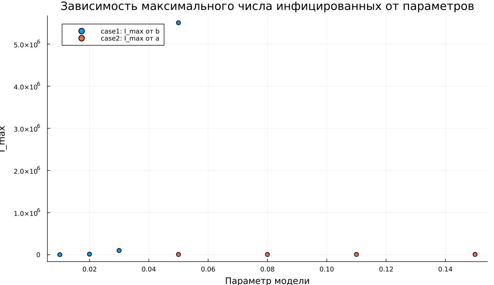

---
## Author
author:
  name: Сергей Павленко
  email: 1032235465@rudn.ru
  affiliation:
    - name: Российский университет дружбы народов
      country: Российская Федерация
      postal-code: 117198
      city: Москва
      address: ул. Миклухо-Маклая, д. 6

## Title
title: "Математическое моделирование"
subtitle: "Лабораторная работа № 6"
license: "CC BY"
---

# Цель работы

Рассмотреть и исследовать эпидемиологическую модель $SIR$.

# Задание

1. Изучить математическую модель распространения эпидемии.
2. Построить графики изменения численности особей в каждой из трёх групп. Проанализировать развитие эпидемии для двух случаев: $I(0)\leq I^*$ и $I(0)>I^*$.

# Выполнение лабораторной работы

## Теоретические сведения

Рассмотрим простую модель эпидемического процесса. Пусть имеется некоторая изолированная популяция численностью $N$. Все особи этой популяции делятся на три группы.

К первой группе относятся восприимчивые к заболеванию, но ещё не инфицированные особи. Их количество обозначается через $S(t)$. Вторая группа включает инфицированных особей, которые одновременно являются источниками распространения инфекции. Их число обозначим через $I(t)$. Третья группа описывает особей, которые уже не участвуют в распространении заболевания и обладают иммунитетом. Их количество обозначается через $R(t)$.

Пока число заражённых не превышает некоторого критического значения $I^*$, предполагается, что инфицированные изолированы и не передают болезнь восприимчивым особям. Если же выполняется условие $I(t)>I^*$, то заражённые начинают распространять инфекцию среди здоровых восприимчивых особей.

Тогда скорость изменения числа восприимчивых особей описывается следующим образом:

$$
\frac{dS}{dt}=
 \begin{cases}
	-\alpha S, & \text{если } I(t) > I^*,\\
	0, & \text{если } I(t) \leq I^*.
 \end{cases}
$$

Каждая восприимчивая особь, которая заражается, переходит в группу инфицированных. Поэтому изменение числа заражённых определяется разностью между количеством новых заболевших и количеством тех, кто перестаёт быть инфекционным вследствие выздоровления или изоляции. В результате получаем:

$$
\frac{dI}{dt}=
 \begin{cases}
	\alpha S-\beta I, & \text{если } I(t) > I^*,\\
	-\beta I, & \text{если } I(t) \leq I^*.
 \end{cases}
$$

Количество выздоровевших или выбывших из эпидемического процесса особей изменяется по закону:

$$
\frac{dR}{dt}=\beta I.
$$

Здесь параметры $\alpha$ и $\beta$ являются коэффициентами заболеваемости и выздоровления соответственно. Для однозначного определения решения системы необходимо задать начальные условия.

Пусть в начальный момент времени $t=0$ количество особей с иммунитетом равно $R(0)$, число инфицированных равно $I(0)$, а число восприимчивых к заболеванию равно $S(0)$. Для анализа динамики модели необходимо отдельно рассмотреть два режима:

$$
I(0)\leq I^*
$$

и

$$
I(0)>I^*.
$$

### Задача

На острове началась эпидемия. Известно, что общая численность населения острова равна

$$
N=11400.
$$

В начальный момент времени $t=0$ число заболевших людей, которые являются распространителями инфекции, составляет

$$
I(0)=250.
$$

Число здоровых людей, обладающих иммунитетом к заболеванию, равно

$$
R(0)=47.
$$

Следовательно, количество людей, восприимчивых к болезни, но ещё не заболевших, определяется выражением

$$
S(0)=N-I(0)-R(0).
$$

Необходимо построить графики изменения численности всех трёх групп: $S(t)$, $I(t)$ и $R(t)$.

Требуется рассмотреть два варианта развития эпидемии:

1. $I(0)\leq I^*$;
2. $I(0)>I^*$.

Для моделирования процесса и построения графиков использовались внешние файлы с программным кодом:





## Базовые эксперименты

### Первая модель (model_type = case1)

Для первой модели характерно нетипичное поведение динамической системы. Количество восприимчивых особей $S(t)$ не изменяется с течением времени. Это согласуется с уравнением

$$
\frac{dS}{dt}=0.
$$

При этом число инфицированных $I(t)$ растёт по экспоненциальному закону, а величина $R(t)$ уменьшается и со временем принимает отрицательные значения.

Такой результат не соответствует смыслу классической эпидемиологической модели. В реальном эпидемическом процессе переменная $R(t)$ должна оставаться неотрицательной, поскольку она описывает количество выздоровевших или выбывших особей. Кроме того, в данной модели отсутствует механизм, ограничивающий рост числа заражённых.

Фазовый портрет также показывает вырожденный характер динамики. Поскольку величина $S$ остаётся постоянной, траектория практически превращается в вертикальную линию. Это означает, что изменение состояния системы происходит только по переменной $I$, а сама модель фактически сводится к одномерному процессу.

Таким образом, первая модель приводит к неограниченному росту числа инфицированных и не описывает реалистичное распространение заболевания.

### Вторая модель (model_type = case2)

Во второй модели наблюдается поведение, характерное для стандартной $SIR$-системы. Число восприимчивых особей $S(t)$ монотонно уменьшается, поскольку часть здорового населения заражается и переходит в группу инфицированных.

Количество инфицированных $I(t)$ сначала возрастает, затем достигает максимального значения, после чего постепенно снижается и стремится к нулю. Одновременно с этим число выбывших или выздоровевших особей $R(t)$ монотонно увеличивается.

Такой характер изменения переменных соответствует естественному ходу эпидемии в замкнутой популяции. В начале процесса инфекция активно распространяется, так как восприимчивых особей много. Затем их число уменьшается, скорость заражения падает, и эпидемия постепенно затухает.

Фазовая траектория имеет вид незамкнутой кривой. Сначала она движется вверх, что соответствует росту $I$ при уменьшении $S$. После прохождения пика число инфицированных начинает снижаться, и траектория постепенно опускается вниз.

В отличие от первой модели, во втором случае система стремится к устойчивому предельному состоянию:

$$
I(t)\to 0.
$$

При этом $S(t)$ выходит на некоторый остаточный уровень, а $R(t)$ достигает конечного значения.

## Параметрическое сканирование

### Траектории $S(t)$ для различных параметров

Анализ графиков $S(t)$ показывает, что две модели реагируют на изменение параметров принципиально по-разному.

В первой модели, соответствующей случаю `case1`, значение $S(t)$ остаётся постоянным независимо от выбранных параметров. Это напрямую связано с тем, что для данной модели выполняется условие

$$
\frac{dS}{dt}=0.
$$

Следовательно, изменение коэффициентов не оказывает влияния на динамику восприимчивых особей.

Во второй модели, соответствующей случаю `case2`, количество восприимчивых особей убывает. Скорость этого убывания зависит от параметра $a$. При увеличении $a$ процесс заражения становится более интенсивным, поэтому группа восприимчивых уменьшается быстрее.

Основные выводы по графикам $S(t)$:

- в первой модели величина $S(t)$ остаётся неизменной;
- во второй модели $S(t)$ убывает во времени;
- параметр $a$ определяет скорость уменьшения числа восприимчивых особей.

### Траектории $I(t)$ для различных параметров

Для первой модели во всех рассмотренных случаях наблюдается экспоненциальное увеличение $I(t)$. При росте параметра $b$ скорость увеличения числа инфицированных становится значительно выше, что приводит к очень большим значениям переменной $I$.

Во второй модели динамика имеет другой характер. Сначала число заражённых возрастает, затем достигает максимума, после чего начинается спад. Параметр $a$ влияет как на высоту пика, так и на момент его достижения. При больших значениях $a$ пик инфицированных наступает быстрее, но и последующее уменьшение также происходит более интенсивно.

Можно выделить следующие особенности:

- первая модель показывает неограниченный рост числа инфицированных;
- вторая модель формирует типичную эпидемическую волну;
- параметры определяют скорость развития эпидемии и масштаб изменения переменных.

### Траектории $R(t)$ для различных параметров

Для первой модели характерно уменьшение $R(t)$. При этом значения данной переменной становятся отрицательными и быстро увеличиваются по модулю. Такое поведение противоречит физическому смыслу модели, поскольку количество выздоровевших или выбывших особей не может быть отрицательным.

Во второй модели величина $R(t)$, наоборот, монотонно возрастает и постепенно приближается к некоторому предельному уровню. Это соответствует накоплению людей, которые уже переболели или перестали участвовать в распространении инфекции.

Изменение параметров влияет на скорость роста $R(t)$. Чем интенсивнее протекает заражение, тем быстрее увеличивается количество выбывших особей.

Итоги анализа:

- первая модель приводит к нефизичным значениям $R(t)$;
- во второй модели $R(t)$ корректно описывает накопление переболевших;
- параметры системы влияют на скорость выхода переменной $R(t)$ на предельный уровень.

### Фазовые траектории для различных параметров

Фазовые портреты позволяют наглядно увидеть качественное различие между двумя моделями.

В первой модели все траектории имеют вид вертикальных линий. Это объясняется тем, что величина $S$ не изменяется, а вся динамика связана только с изменением $I$. Такая картина указывает на отсутствие полноценного взаимодействия между переменными $S$ и $I$.

Во второй модели фазовые траектории имеют характерную форму кривых, соответствующих эпидемическому процессу. На первом этапе наблюдается рост числа инфицированных при одновременном снижении числа восприимчивых. Затем, после достижения максимума $I$, начинается спад числа заражённых, а значение $S$ продолжает уменьшаться.

Таким образом, изменение параметров не меняет общего характера поведения моделей:

- первая модель остаётся вырожденной;
- вторая модель сохраняет реалистичную структуру эпидемической динамики.

### Анализ метрики norm_final

Для количественной оценки конечного состояния системы использовалась метрика

$$
\text{norm\_final}=\sqrt{S(t_{final})^2+I(t_{final})^2+R(t_{final})^2}.
$$

В первой модели значение $\text{norm\_final}$ быстро увеличивается при росте параметра $b$. Это связано с экспоненциальным увеличением $I(t)$ и одновременным уходом $R(t)$ в отрицательную область. В результате итоговая норма состояния становится очень большой.

Во второй модели значения данной метрики заметно меньше и изменяются более плавно. Это объясняется тем, что система не расходится, а приходит к конечному состоянию. В этом состоянии число инфицированных стремится к нулю:

$$
I(t)\to 0,
$$

а значения $S(t)$ и $R(t)$ остаются конечными.

Следовательно:

- для первой модели метрика демонстрирует неограниченный рост;
- для второй модели она характеризует конечное устойчивое состояние системы.

### Анализ максимального числа инфицированных

Максимальное число инфицированных $I_{max}$ существенно зависит от параметров модели.

В первой модели $I_{max}$ принимает крайне большие значения. Это объясняется отсутствием механизма, который мог бы ограничить рост числа заражённых. При увеличении параметра $b$ максимальное значение $I(t)$ резко возрастает.

Во второй модели величина $I_{max}$ остаётся конечной. Она зависит от параметра $a$, который определяет интенсивность заражения. При увеличении $a$ максимум достигается быстрее, однако сама эпидемическая волна остаётся ограниченной по численности.

Из этого следует:

- первая модель приводит к неограниченному росту $I_{max}$;
- вторая модель описывает ограниченную и более реалистичную эпидемическую волну.

### Время вычислений

Результаты бенчмаркинга показывают, что время численного решения во всех экспериментах остаётся малым. Его порядок составляет примерно

$$
10^{-4}\text{ сек}.
$$

Для обеих моделей изменение параметров практически не влияет на вычислительные затраты. Небольшие колебания времени можно объяснить особенностями используемого численного метода, а также адаптивным выбором шага интегрирования.

Можно сделать следующие выводы:

- обе модели эффективно решаются численными методами;
- изменение параметров почти не отражается на времени вычислений;
- даже при быстром росте решений в первой модели время расчёта остаётся малым.

## Выводы

1. Первая модель (`case1`) демонстрирует экспоненциальный и неограниченный рост числа инфицированных при постоянном количестве восприимчивых особей. Это указывает на её нефизичный характер и отсутствие стабилизирующего механизма.
2. Вторая модель (`case2`) воспроизводит типичную эпидемическую динамику: сначала число инфицированных возрастает, затем достигает максимума и постепенно уменьшается.
3. Фазовые портреты подтверждают различие между моделями. В первой модели траектория вырождена и имеет почти вертикальный вид, а во второй формируется полноценная фазовая кривая.
4. Параметры $a$ и $b$ заметно влияют на динамику системы. Параметр $a$ определяет интенсивность уменьшения числа восприимчивых, а параметр $b$ влияет на изменение числа инфицированных.
5. Метрика $\text{norm\_final}$ позволяет количественно сравнить модели. В первой модели она быстро возрастает, а во второй отражает переход системы к конечному состоянию.
6. Максимальное число инфицированных $I_{max}$ в первой модели может расти без ограничения, тогда как во второй модели оно остаётся конечным.
7. Численное моделирование обеих систем выполняется быстро, а изменение параметров не приводит к существенному увеличению времени вычислений.

# Список литературы {.unnumbered}

1. [Конструирование эпидемиологических моделей](https://habr.com/ru/post/551682/)
2. [Зараза, гостья наша](https://nplus1.ru/material/2019/12/26/epidemic-math)
